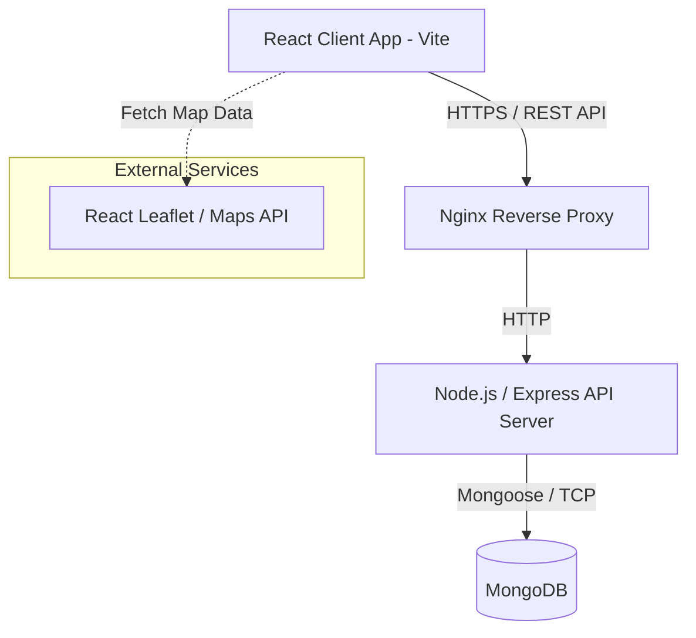
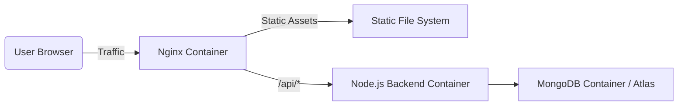

# High Level Design (HLD) - Sarvhit

## 1. Introduction
The Sarvhit Impact Platform is a web-based ecosystem that connects NGOs, Volunteers, and Sponsors. It facilitates event management, volunteering hours tracking, donations, and impact reporting. 

## 2. System Architecture
The system uses a classic 3-tier MERN (MongoDB, Express, React, Node.js) architecture.

### Architecture Diagram

## 3. Core Components

### 3.1. Frontend (Client)
- **Framework**: React 19 built with Vite.
- **Routing**: React Router v7.
- **State Management**: React Context API for global state like Authentication and User Profile.
- **Styling**: Vanilla CSS or styling tokens, combined with Framer Motion for animations.
- **Key Portals**: 
  - NGO Dashboard
  - Volunteer Dashboard
  - Sponsor Dashboard
  - Interactive Impact Map

### 3.2. Backend (Server)
- **Framework**: Node.js with Express 4.
- **API Style**: RESTful API design.
- **Authentication**: JWT-based stateless authentication.
- **Responsibilities**: Business logic, data validation, processing donations, event management, and serving APIs to the frontend.

### 3.3. Database
- **Database Engine**: MongoDB (NoSQL).
- **ORM**: Mongoose for schema validation and object modeling.
- **Design Strategy**: Single `User` collection utilizing roles (ngo, volunteer, sponsor) to store specific user properties dynamically.

## 4. Deployment Architecture
- **Containerization**: Docker and Docker Compose.
- **Web Server / Proxy**: Nginx to serve static frontend files and reverse proxy API requests to the Node.js backend.
- **CI/CD**: GitHub Actions for automated building, testing, and pushing images to GitHub Container Registry (GHCR).

## 5. Security & Scaling
- **Authentication**: Passwords hashed using `bcryptjs`. API routes protected by JWT middleware.
- **Scalability**: Dockerized environment allows for easy horizontal scaling of the Node backend.
- **Security**: Nginx configured for basic DDoS protection, rate limiting, and SSL/TLS termination.
