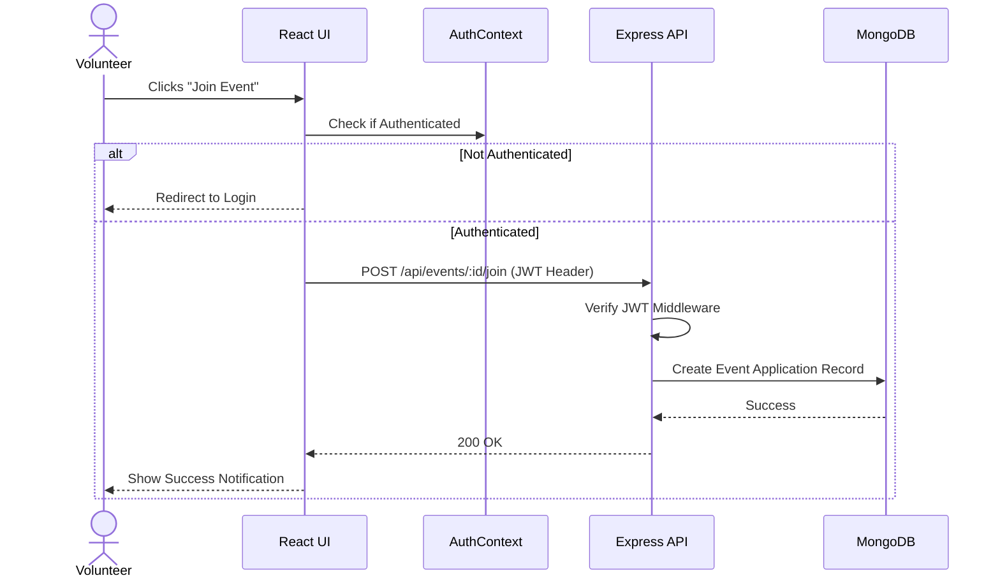

# Low Level Design (LLD) - Sarvhit

## 1. Introduction
This document outlines the Low Level Design (LLD) for the Sarvhit Impact Platform, detailing the database schemas, API structures, and frontend component hierarchies based on the existing codebase.

## 2. Database Design

### 2.1. User Schema (MongoDB / Mongoose)
The `User` collection utilizes a unified schema pattern with role-based attributes (found in `server/src/models/User.js`).

**Core Fields:**
- `name` (String, required)
- `email` (String, required, unique)
- `password` (String, hashed via bcrypt, required)
- `role` (Enum: `['ngo', 'volunteer', 'sponsor']`, required)
- `avatar`, `bio`, `location` (String, optional)
- `timestamps` (createdAt, updatedAt)

**Role-Specific Fields:**
- **NGO**: `founded`, `eventsHosted`, `volunteersConnected`, `fundsReceived`
- **Volunteer**: `skills` (Array of Strings), `hoursLogged`, `eventsJoined`, `badgesEarned`
- **Sponsor**: `sectors` (Array of Strings), `totalDonated`, `projectsFunded`, `impactScore`

*Future collections to be added (if not already): `Event`, `Donation`, `Application`, `Message`.*

## 3. Backend API Design (Express.js)

### 3.1. Directory Structure
```
server/src/
 ├── config/      # Database connections (e.g., MongoDB setup)
 ├── controllers/ # Request handlers for endpoints
 ├── middleware/  # Custom middlewares (e.g., Auth, Error handling)
 ├── models/      # Mongoose Schemas (User.js)
 ├── routes/      # Express Routers matching controllers
 └── utils/       # Helpers and utility functions
```

### 3.2. Authentication Flow
1. **POST `/api/auth/register`**: Validates input -> Hashes password (`bcrypt.genSalt(12)`) -> Saves User -> Returns JWT.
2. **POST `/api/auth/login`**: Finds User by email -> compares password -> Generates and returns JWT.
3. **GET `/api/auth/me`**: Protected route, expects `Authorization: Bearer <token>`. Returns current user context.

### 3.3. Proposed / Expected API Endpoints
- **Users**: `/api/users/:id`, `/api/users/role/:role`
- **Events**: `/api/events` (CRUD for NGOs, Read-Only for Volunteers/Sponsors)
- **Donations**: `/api/donations` (POST for Sponsors, GET for NGOs)

## 4. Frontend Component Design (React)

### 4.1. Directory Structure
```
client/src/
 ├── components/  # Shared buttons, modals, form inputs, cards
 ├── context/     # React contexts (e.g., AuthContext)
 ├── hooks/       # Custom hooks (e.g., useAuth)
 ├── layouts/     # App shell layouts (Sidebar, Topbar)
 ├── pages/       # Feature pages (Auth, Dashboard, Discover, NGO, etc.)
 ├── services/    # API service layers
 ├── styles/      # Global CSS tokens & utilities
 └── utils/       # Formatting helpers
```

### 4.2. Routing & Views
- **Public Routes**: `/`, `/login`, `/register`, `/discover`
- **Protected Routes** (Guarded by Context):
  - `/dashboard`: Dynamically renders components for NGO, Volunteer, or Sponsor.
  - `/profile` / `/user-profile`: User management.
  - `/events`: Event listings and details.
  - `/impact-map`: Interactive Leaflet map displaying active events/NGOs.
  - `/leaderboard`: Gamification view.
  - `/messages`: In-app communication.

### 4.3. State Management
- **Global**: AuthContext holds user session `{ user, token, isAuthenticated }`.
- **Local**: Component-level state (`useState`, `useReducer`) used for form handling and UI interactivity.

## 5. Sequence Diagram: Event Registration (Volunteer Flow)

